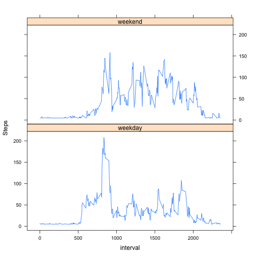

## Reproducible Research: Peer Assessment 1  


### Loading and preprocessing the data


```r
activity<-read.csv("activity.csv")
activity<-transform(activity,date = as.Date(date))
var<-c("Variable names:", names(activity))
var
```

```
## [1] "Variable names:" "steps"           "date"            "interval"
```


### What are the mean and median of total number of steps taken per day?
Creating aggregates of steps per day:

```r
act2<-aggregate(activity$steps,by=list(activity$date),FUN=sum)
names(act2)<-c("date","totalsteps")
act3<-subset(act2,!is.na(act2$totalsteps))  ##excluding NA values

Meantotalsteps<-paste("Mean of total steps:",mean(act3$totalsteps))
Mediantotalsteps<-paste("Median of total steps:", median(act3$totalsteps))
Meantotalsteps
```

```
## [1] "Mean of total steps: 10766.1886792453"
```

```r
Mediantotalsteps
```

```
## [1] "Median of total steps: 10765"
```

Histogram of the total steps per day:


```r
hist(act3$totalsteps,breaks=10, main="Histogram of total steps per day",xlab="Total Steps")
```

 

### What is the average daily activity pattern?
Calculating the average number of steps per interval across all days 


```r
act4<-aggregate(activity$steps,by=list(activity$interval),FUN=mean,na.rm=TRUE)
names(act4)<-c("interval","Avgstepsinterval")
maxsteps<-max(act4$Avgstepsinterval)
act5<-subset(act4,act4$Avgstepsinterval==maxsteps)
higheststeps<-paste("The maximum average steps for any interval is", maxsteps)
highestinterval<-paste("The interval with the maximum average steps is :",act5$interval)
higheststeps
```

```
## [1] "The maximum average steps for any interval is 206.169811320755"
```

```r
highestinterval
```

```
## [1] "The interval with the maximum average steps is : 835"
```

Now drawing a time series plot of the 5-minute interval (x-axis) and the average number of steps taken, averaged across all days (y-axis)


```r
plot(act4$interval,act4$Avgstepsinterval,type="l",main="Graph of average activity per time interval",xlab="5 minute interval",ylab="Average steps per interval")
```

 


### Imputing missing values
Counting the number of rows with missing values :


```r
act6<-subset(activity,is.na(activity$steps))
paste("Total number of rows with missing values:",nrow(act6))
```

```
## [1] "Total number of rows with missing values: 2304"
```

Replacing all NA's with the average steps over all intervals for all days

```r
averagesteps<-mean(activity$steps,na.rm=TRUE)
activity$steps<-replace(activity$steps,is.na(activity$steps),averagesteps)
```

Aggregate by total number of steps per day with missing values imputed

```r
aggact<-aggregate(activity$steps,by=list(activity$date),FUN=sum)
names(aggact)=c("date","totalsteps")
head(aggact, n=4)
```

```
##         date totalsteps
## 1 2012-10-01      10766
## 2 2012-10-02        126
## 3 2012-10-03      11352
## 4 2012-10-04      12116
```
Mean and median of total number of steps for new data set with imputed missing values

```r
paste("Mean of total number of steps, imputed missing values:",mean(aggact$totalsteps))
```

```
## [1] "Mean of total number of steps, imputed missing values: 10766.1886792453"
```

```r
paste("Median of total number of steps, imputed missing values",median(aggact$totalsteps))
```

```
## [1] "Median of total number of steps, imputed missing values 10766.1886792453"
```

Histogram of the total number of steps taken each day from dataset with imputed missing values

```r
hist(aggact$totalsteps,main="Histogram of total steps per day, imputed missing values",xlab="Total steps",breaks=10)
```

 


### Are there differences in activity patterns between weekdays and weekends?
Organize data by weekdays and weekends

```r
head(activity)  ## Refresher on how the data set looks after missing values are imputed
```

```
##   steps       date interval
## 1 37.38 2012-10-01        0
## 2 37.38 2012-10-01        5
## 3 37.38 2012-10-01       10
## 4 37.38 2012-10-01       15
## 5 37.38 2012-10-01       20
## 6 37.38 2012-10-01       25
```

```r
activity$dayofweek<-weekdays(activity$date)  ## Add another column for day of week
activity$dayofweek<-replace(activity$dayofweek,!(activity$dayofweek=="Saturday"|activity$dayofweek=="Sunday"),"weekday")
activity$dayofweek<-replace(activity$dayofweek,(activity$dayofweek=="Saturday"|activity$dayofweek=="Sunday"),"weekend")
## Looking at the transformed data after organizing by weekday and weekend
head(activity[activity$dayofweek=="weekday",],n=4)
```

```
##   steps       date interval dayofweek
## 1 37.38 2012-10-01        0   weekday
## 2 37.38 2012-10-01        5   weekday
## 3 37.38 2012-10-01       10   weekday
## 4 37.38 2012-10-01       15   weekday
```

```r
head(activity[activity$dayofweek=="weekend",],n=4)
```

```
##      steps       date interval dayofweek
## 1441     0 2012-10-06        0   weekend
## 1442     0 2012-10-06        5   weekend
## 1443     0 2012-10-06       10   weekend
## 1444     0 2012-10-06       15   weekend
```

Averages per interval for both weekdays and weekends

```r
activity$dayofweek<-as.factor(activity$dayofweek)
actavgdow<-aggregate(activity$steps,by=list(activity$interval,activity$dayofweek),FUN=mean)
names(actavgdow)<-c("interval","dayofweek","avgsteps")
head(actavgdow,n=4)  ## Looking at the data after organizing by averages per interval for weekdays and weekends
```

```
##   interval dayofweek avgsteps
## 1        0   weekday    7.007
## 2        5   weekday    5.384
## 3       10   weekday    5.140
## 4       15   weekday    5.162
```

Now plotting 5-minute interval (x-axis) and the average number of steps taken averaged across all weekday days or weekend days (y-axis)


```r
library(lattice)
xyplot(avgsteps~interval | dayofweek, data = actavgdow, layout=c(1,2),type="l",ylab="Steps")
```

 


